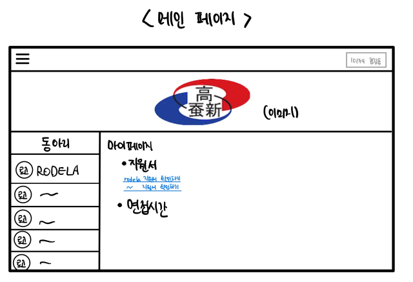
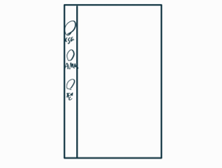
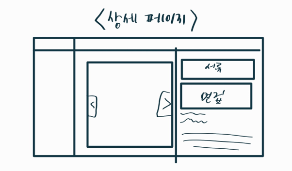

# club-recruit
2023년 잠신고등학교 상설동아리 모집 사이트입니다.

* 개발 환경 설정: [DEV_SETUP.md](DEV_SETUP.md)
* 서버 설정: [PRODUCTION.md](PRODUCTION.md)

## 1. 서론
작년에 1학년으로써 동아리에 지원하는 입장이었던 우리는, 인스타그램을 통한 동아리 홍보의 단점을 느꼈다. 올해는 2학년으로써 동아리 부원을 선발하는 위치에 서게 되었고, 작년 방식의 한계점을 극복하기 위해 동아리 통합 지원 사이트를 직접 제작하여 운영하기로 하였다.

## 2. 사전 조사 
**[상설동아리 모집 사이트 운영 계획서.pdf](https://github.com/jsrodela/club-recruit/blob/main/readme/%EC%83%81%EC%84%A4%EB%8F%99%EC%95%84%EB%A6%AC%20%EB%AA%A8%EC%A7%91%20%EC%82%AC%EC%9D%B4%ED%8A%B8%20%EC%9A%B4%EC%98%81%20%EA%B3%84%ED%9A%8D%EC%84%9C.pdf)**

## 3. 구조 및 설계
### 3-1. 초기 구상

* 로그인 후 보이는 페이지
  * 왼쪽의 동아리 클릭 시 각 동아리 별 상세 페이지로 이동 
  * 로그인을 완료하면 오른쪽 위에 학번/이름을 띄움 
  * 오른쪽 아래 화면은 각 학생이 어떤 동아리에 지원했으며, 작성한 지원서와 신청한 면접 시간을 확인 가능

  * 모바일 용 메인 페이지를 따로 제작해서 핸드폰으로도 쉽게 접속하고 신청할 수 있도록 할 예정

* 각 동아리 별 상세페이지 
  * 왼쪽엔 메인 페이지와 똑같이 동아리 목록 
  * 가운데 사진은 각 동아리에서 추가하고 싶은 이미지 추가 (인스타에서 사용하던 안내 및 홍보 포스터 등)
  * 오른쪽에 서류 제출 버튼과 면접 제출 버튼 (가능한 시간에 활성화)
  * 오른쪽 아래에는 간단한 서류 제출 방식이나, 동아리 홍보 문구, 모집 조건 등 동아리별로 추가글 작성

* 면접 신청 방식 
  * 영화 좌석 예매 형식으로 진행 
  * 주간 캘린더 형식

### 3-2. 사이트 구조
> `동아리`는 각 동아리의 영문 코드를 말합니다. (예: rodela, asap, book, ...)
- **메인 페이지** (`/`) : 지원한 동아리, 면접 일정, 내 정보 등을 한눈에 볼 수 있는 홈 화면
- **소개 페이지** (`/about/동아리`) : 동아리 소개 사진, 홍보 문구와 '지원하기' 버튼이 있는 화면
- 지원 관련
  - **지원 페이지** (`/form/submit/동아리`): 동아리 지원 양식 작성 화면
  - **지원서 확인 페이지** (`/form/views/동아리`) : 자신이 작성한 지원서를 확인할 수 있는 화면
  - **면접시간 선택 페이지** (`/form/time/동아리`) : 1차 합격자 대상으로 면접 시간을 선택할 수 있는 화면
  - **부장 지원서 확인 페이지** (`/form/leader/지원번호`) : 부장 및 부원들이 `지원번호` 지원서를 확인할 수 있는 화면 (해당 동아리에만 열람 권한 존재)
- 부장 관련
  - **동아리 관리 페이지** (`/leader/club_config`) : 부장 전용 동아리 설정 화면. 동아리 정보, 소개페이지 설정 및 부원 추가 기능
  - **1차 서류 확인 페이지** (`/leader/view_forms`) : 부장 및 부원 전용, 본인 동아리에 제출된 지원서 목록 화면.
  - **면접시간 설정 페이지** (`/leader/time_config`) : 부장 전용 2차 면접시간 설정 화면.
  - **1차 결과 결정 페이지** (`/leader/first_result`) : 

### 3-3. 프로젝트 구조
- about: 소개페이지 관련 / `ClubModel` `ImageModel`
- account: 유저 계정 및 로그인 관련 / `User`
- form: 지원 관련 (1차 지원서 및 2차 면접시간 포함) / `FormModel`
- index: 메인페이지 관련
- jamsinclub: 장고 메인 모듈
- leader: 부장 및 동아리 관리페이지 관련

### 3-4. DB 구조

#### 3-4-1. UserModel
> Django에서 기본 제공하는 `AbstractBaseUser` 클래스를 참조하고 있습니다.
> 
> `PhoneNumberField`는 `django-phonenumber-field` 모듈의 모델입니다.

| 이름        | 설명               | 타입                   | 비고                                                         |
|-----------|------------------|----------------------|------------------------------------------------------------|
| id        | 학번               | PositiveIntegerField | PrimaryKey, Unique, NotNull, NotBlank      |
| name      | 이름               | CharField | MaxLength=5, NotNull, NotBlank                             |
| phone     | 전화번호             |PhoneNumberField| NotNull, NotBlank                                          |
|           |
| leader_of | 해당 동아리의 부장 권한 보유 |ForeignKey (ClubModel)| RelatedName='leader_of+', NullOnDelete, Nullable, Blankable |
| member_of | 해당 동아리의 부원 권한 보유 |ForeignKey (ClubModel)| RelatedName='member_of+', NullOnDelete, Nullable, Blankable |

#### 3-4-2. ClubModel
|변수| 설명                                                       | 타입                           | 비고                                                                   |
|-|----------------------------------------------------------|------------------------------|----------------------------------------------------------------------|
|name| 동아리 이름                                                   | CharField                    | MaxLength=100                                                        |
|code| 동아리 영문 코드                                                | CharField                    | PrimaryKey, Unique, MaxLength=10                                     |
||
|form_start| 1차 지원서 제출 시작 시각                                          | DateTimeField                |                                                                      |
|form_end| 1차 지원서 제출 마감 시각                                          | DateTimeField                |                                                                      |
||
|index_banner_image| 메인페이지 배너 이미지                                             | ForeignKey (ImageModel)      | RelatedName='index_banner_image+', NullOnDelete, Nullable, Blankable |
|index_banner_description| 매인페이지 배너 한줄소개                                            | TextField                    |                                                                      |
|index_banner_color| 메인페이지 배너 글자 색상 (#000000 or #ffffff)                      | CharField                    | MaxLength=7                                                          |
||
|about_background| 소개페이지 배경사진                                               | ImageModel                   | RelatedName='index_banner_image+', NullOnDelete, Nullable, Blankable |
|about_images| 소개페이지 사진칸에 들어갈 사진들                                       | ManyToManyField (ImageModel) | RelatedName='about_images+, Blankable                                |
|about_text| 소개페이지 홍보 문구 (HTML/마크다운 문법 지원)                            | TextField                    |                                                                      |
||
|logo_image| 동아리 로고 (왼쪽 동아리 목록 메뉴에 표시)                                | ForeignKey (ImageModel)      | RelatedName='logo_image+', NullOnDelete, Nullable, Blankable         ||
||
|form_data| 구글폼에서 받아온 1차 지원서 양식 (수동 동기화 필요)                          | JSONField                    | dict 형식                                                              |
|form_edit_url| 구글폼 수정 바로가기 링크                                           | URLField                     | Nullable, Blankable                                                  |
|kakao_url| 지원서 기능 미사용 시, 오픈채팅 등 지원 가능한 외부 링크 (이 값이 존재하면 지원서 기능 비활성화) | URLField                     | Nullable, Blankable                                                  |
|members| 멤버 목록 (지원서, 면접시간 확인 권한) - `User`과 자동 동기화 안됨              | JSONField                    | list 형식                                                              |
||
|time_use| 2차 면접 시간선택 기능 사용 여부 (기본 비활성화, 시간 설정 시 활성화)               | BooleanField                 ||
|time_start| 2차 면접 시간선택 시작 시각| DateTimeField                ||
|time_data|2차 면접 시간 데이터| list 형식                      |
> `form_data` 형식은 [ExtForm](https://github.com/ExtForm/ExtForm)을 참고하세요. [`form/form_data.py`](form/form_data.py) 파일에 샘플 데이터 형식이 있습니다.
> 
> `members` 형식은 숫자로 이루어진 리스트입니다. (ex. [10000, 10001, 20124])
> 

## 4. 사이트 운영
### 4-1. 준비 (2023. 02. 18. ~ 2023. 03. 01.)
2월 18일, 상설동아리 부장 톡방을 생성하고, 부장들에게 사이트를 통한 모집 계획을 안내하며 협조를 부탁했다. 물론 처음 해보는 시도인 만큼 부장들 간 약간의 혼란이 있었지만, 서로 의견을 조율하며 각 동아리의 소개페이지와 지원 서류를 꾸렸다. 미리 교장선생님과 창의체험부 부장 선생님께 사이트 이용 허락을 받고, 예비소집일 동아리 홍보 시간에도 1학년 학생들에게 사이트를 안내했다.

### 4-2. 1차 지원 (2023. 03. 02. ~ 2023. 03. 14.)
교실 앞 게시판, 중앙현관 게시판, 정보관 앞 게시판 등 학교 곳곳에 동아리 홍보 포스터를 부착하고, 동아리 지원 사이트에서 지원할 수 있다는 내용을 포함했다. 모든 동아리가 사이트에 소개글을 올리고 지원서 제출을 활성화했으며, 학생들은 각자의 학번으로 가입하여 자신이 원하는 동아리를 살펴보고 지원하였다.

### 4-3. 2차 면접 (2023. 03. 08. ~ 2023. 03. 13.)
지원자별로 가능한 시간을 받은 다음 동아리에서 배정하던 작년과는 다르게, 올해는 동아리에서 면접 시간을 열어두면 지원자들이 선택하는 방식으로 운영했다. 사이트 지원서를 사용한 동아리들은 1차 결과를 사이트에 반영하였으며, 학생들은 동아리들의 서류 결과나 면접 시간을 사이트에서 한눈에 확인할 수 있었다.

### 4-4. 운영 종료 (2023. 03. 19. ~ )
모든 상설동아리 모집이 종료되어, 개인정보 보호 및 해킹 방지를 위해 서버 운영을 마무리하였다. 기존 사이트 형식에 맞춰 운영 종료 안내 페이지를 만들고, 해킹 위험이 있는 가상머신 대신 Github Pages를 이용하여 정적 페이지를 호스팅하였다. 서버의 모든 데이터를 안전한 장소로 옮긴 후 서버를 종료했다. 운영 종료를 알리는 페이지를 제작하여, Github Pages를 이용하여 호스팅하였다.

## 5. 개선할 점

### 5-1. 면접시간 선택 시스템 구조 개선
**내년에도 이 시스템을 사용할 경우, 반드시 개선해야 할 사항이다.**

현재 면접시간 선택 시스템의 구조는 동기화 문제가 일어날 여지가 있다. 지금 구조에서는 각 학생의 `FormModel`과 동아리의 `ClubModel`에 지원 시간이 따로 저장되며, DB상에서 둘이 연결되지 않는다. 만약 두 학생이 같은 시각을 동시에 선택하면, 2개의 `FormModel`에 시간이 기록되지만 `ClubModel`에는 학생 수 카운트가 1만 올라갈 수 있다.

추가로 면접시간을 잘못 선택했을 때를 대비하여, 선택을 수정할 수 있는 시스템을 구축할 필요가 있다. 실제 운영에서는 관리자에게 따로 연락하여 선택한 시간을 취소하는 방법을 사용했는데, 약 30명의 학생이 문의하여 처리가 쉽지 않았다.

하나의 개선 방법으로, 면접 시간에 관한 데이터를 담는 새로운 모델(예:`TimeModel`)을 생성하여, `FormModel`에는 `ForeignKey`로, `ClubModel`에는 `ManyToManyField`로 연결해주는 것을 제안한다. 이렇게 하면 새 `TimeModel`을 생성하고 `FormModel`과 `ClubModel`에 동시에 연결되므로, 동기화 문제뿐만 아니라 선택 취소 기능을 구현하기도 훨씬 수월할 것이다.

### 5-2. 기타 개선 사항

- 지원서에서 multiple 타입 질문에 required 속성 (필수 응답) 적용 안됨 (form.js로 적용해야 할듯)
- 지원 마감 기한을 소개페이지에 표기 (동아리 부장이 설정한 시간으로)
- Safari 브라우저에서 1차 서류 화면의 '지원하기' 버튼이 너무 작아짐
- 지원서 삭제기능 말고 수정 기능도 넣기
- 모델 간 연결할 때 ForeignKey나 ManyToManyField를 사용하지 않는 것들이 간혹 있음. (account가 아니라 학번으로 저장해둔다던지...) 시간날때 ForeignKey or ManyToManyField로 변경해두면 통일성도 있고, 오류날 확률도 적을듯.

## 6. 활동 일지
[CHANGES.txt](CHANGES.txt) 참고

## 7. 기여자
RoDeLa 6.0 (2023) : 박도현, 박서현, 이용목, 정현석
